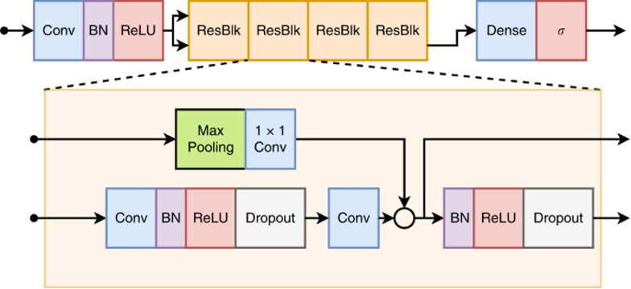
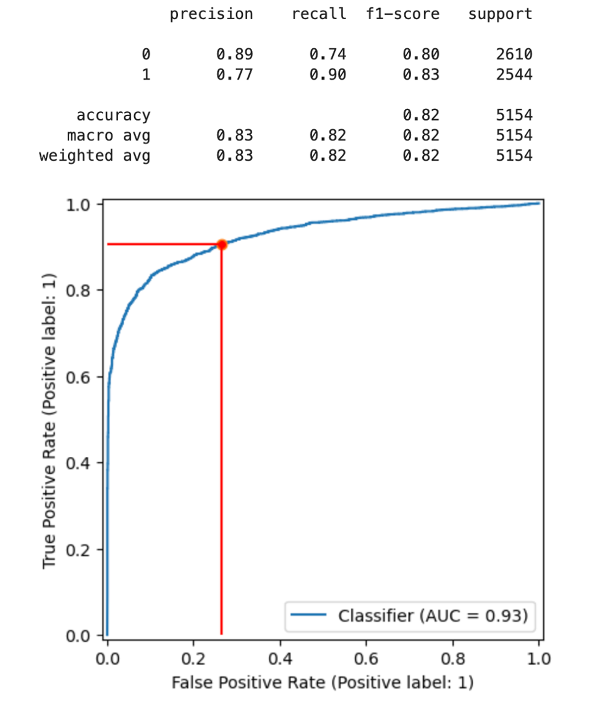

# ECG Abnormality Detection Using a Neural Network
## Overview
This project uses a convolutional neural network to classify electrocardiogram readings into two categories, normal or abnormal. This was my first dive into machine learning and was an excellent way to learn about data processing & analysis with pandas, the different types of neural networks and how to implement them with tensorflow, and the best metrics to evaluate models and tune hyperparameters.

The model architecture used in this project comes from a deep neural network used by researchers to classify six types of arrhythmias from 12-lead ECGs [[1]](#1), which can be found at https://github.com/antonior92/automatic-ecg-diagnosis/. The model in this project was trained on a different, much smaller dataset and is far less accurate. <b>It is for educational purposes only and is not intended to be used in any real-life medical decisions.</b>

## Demo Notebook
The `ecg_abnormality_detection.ipynb` notebook provides the best demonstration of the model's classification functionality along with a visual exploration of the data and  evaluation methods used. Before running this notebook:
1. Download this repository
2. Create a new folder called `data/`
3. Download [metadata.csv](https://springernature.figshare.com/articles/dataset/The_attributes_of_ECG_records/17912441?backTo=%2Fcollections%2FA_large-scale_multi-label_12-lead_electrocardiogram_database_with_standardized_diagnostic_statements%2F5779802&file=34793152) and the [ECG records](https://springernature.figshare.com/articles/dataset/ECG_records/17912444?backTo=%2Fcollections%2FA_large-scale_multi-label_12-lead_electrocardiogram_database_with_standardized_diagnostic_statements%2F5779802&file=32630684) to this newly created folder

All other files needed are included in this repository, including a csv of predictions made by the model on the test dataset so that the notebook can be run without having to run any other scripts (`eval/test_predictions.csv`).

## Python Scripts
* `ECGPyDataset.py` - Inherits from tf.keras.utils.PyDataset; Loads one batch of ECG readings at a time
* `model.py` - Defines the model's architecture
* `train.py` - Compile and train the model
* `eval.py` - Generate classification report and ROC + precision-recall curves

## Training Data
The dataset used can be downloaded [here](https://springernature.figshare.com/collections/A_large-scale_multi-label_12-lead_electrocardiogram_database_with_standardized_diagnostic_statements/5779802). A summary is provided below, see the accompanying publication[[2]](#2) for more detail on the format and methodology. The notebook `preprocessing.ipynb`   was used to prepare the data and split into training and test sets (80/20).

The dataset contains 25,770 ECGs labeled with standardized diagnostic labels according to the American Heart Association. The data is relatively evenly split between classes, with 46.04% of readings containing abnormalities. All readings were taken with a 500hz sample rate, with lengths between 10 and 60 seconds. These signals were already been filtered to reduce noise, and all diagnostic statements were verified by an experienced cardiologist.

Each ECG reading is stored in its own HDF5 file, and can be accessed using the key 'ecg'. Each file contains tracings from all 12 ecg leads with the shape (12, reading_length). Sample code to access the readings can be found in the Jupyter notebooks. To account for the difference in length, slightly less than seconds of each reading was used (4096 samples). Readings were also normalized to contain values between -1 and 1. Finally, the axes of this array were swapped because the model is configured to expect an input with channels last of shape (4096, 12).

Diagnoses are contained in the metadata.csv file, which contains codes for each diagnostic statement. The statements associated with each code are stored in the file code.csv. Since this project was only concerned with abnormal vs. normal readings, minimal preprocessing was required. 

Due to the relatively large size of each ECG reading, a Keras PyDataset is used as input to the model. This allows the model to only load one batch of ECG readings at a time during training and prediction. However, the full metadata.csv file is loaded at once so larger datasets may require the code to be modified to load the labels in batches as well.

## Model Architecture
As explained in the overview, the model architecture was adapted from [[1]](#1); the code used in this paper can be found at: https://github.com/antonior92/automatic-ecg-diagnosis/. This model was based on the ResNet image classification model [[3]](#3)  modified for a 1-d input.
 

It consists of an initial convolutional layer followed by four residual blocks containing two convolutional layers each. Batch normalization, ReLU activation, and dropout are applied between convolutional layers. Skip connections are placed between residual blocks prevent the performance degradation that has been observed in deep networks as the number of layers increases.[[3]](#3) Finally, a dense layer with a sigmoid activation outputs a result from 0 to 1. Threshold selection is discussed in the next section.

The model was trained using a binary cross-entropy loss function and the Adam optimizer. 20% of the training data was held out for validation during training, with early stopping once validation loss began to increase. Multiple learning rates and batch sizes were tested, with the final model trained using a batch size of 16 and learning rate of 0.0005.

## Model Performance
The threshold was selected by plotting the receiver operating characteristic (ROC) curve and assessing the tradeoffs at different values. In this case a positive result indicates an abnormal ECG. Recall was emphasized because missing a medically significant abnormality (a false negative) would likely be more dangerous than marking a normal ECG as abnormal (a false positive). With this in mind, a threshold of 0.25 was selected. At this threshold, recall on the test data was 0.90 with an accuracy of 0.82. Accuracies up to 0.86 were obtained using a higher threshold.

The relatively small dataset is likely the cause for the low accuracy compared to that obtained in the study that the model was adopted from (25k samples vs  > 3 million). 
An earlier version of the model (in the all-categories branch of this repo) attempted to classify the readings into 11 categories identified by the dataset publishers, but had very poor results on the less common classes.

## References
<a id="1">[1]</a>
Ribeiro, A. H., Ribeiro, M. H., Paixão, G. M., Oliveira, D. M., Gomes, P. R., Canazart, J. A., Ferreira, M. P., Andersson, C. R., Macfarlane, P. W., Meira, W., Schön, T. B., & Ribeiro, A. L. (2020). Automatic diagnosis of the 12-lead ECG using a deep neural network. Nature Communications, 11(1). https://doi.org/10.1038/s41467-020-15432-4

<a id="2">[2]</a>
Liu, H., Chen, D., Chen, D. et al. A large-scale multi-label 12-lead electrocardiogram database with standardized diagnostic statements. Sci Data 9, 272 (2022). https://doi.org/10.1038/s41597-022-01403-5 

<a id="3">[3]</a>
He, K., Zhang, X., Ren, S. & Sun, J. Deep residual learning for image recognition. In Proc. IEEE Conference on Computer Vision and Pattern Recognition (CVPR) 770–778 (IEEE, 2016). https://doi.org/10.48550/arXiv.1512.03385
